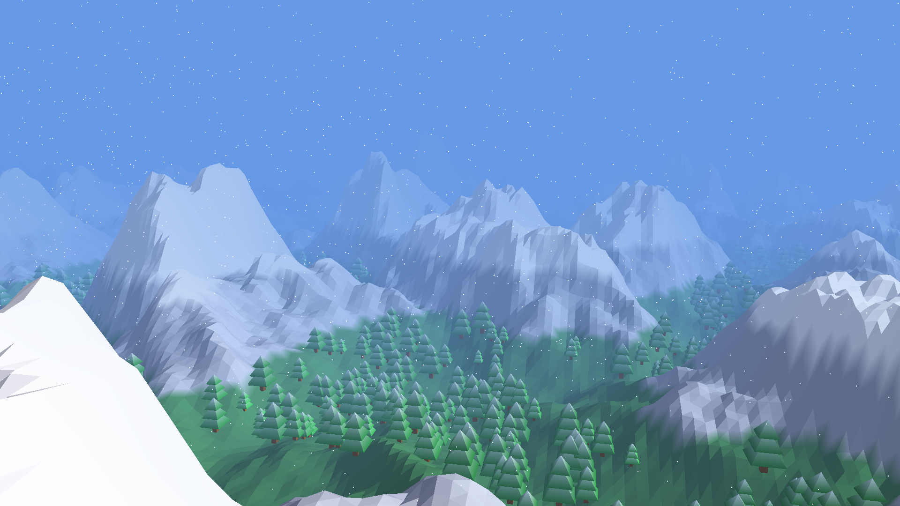
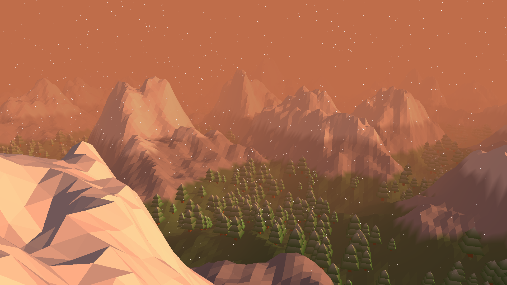
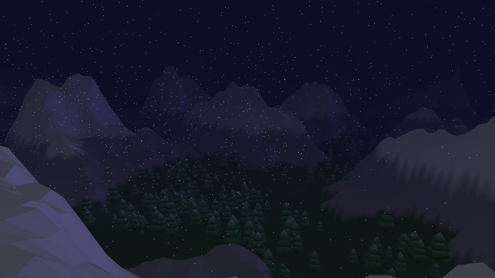

# Bosque Nevado

Animación 3D interactiva de un bosque nevado con montañas, niebla y ciclo de día y noche. Diseñada para ser una experiencia contemplativa y tranquila.

<div align="center">
  
</div>

## Características Principales

*   **Mundo Procedimental Detallado:** El terreno se genera dinámicamente utilizando *Fractional Brownian Motion (FBM)* sobre ruido Simplex. El mundo tiene un tamaño definido de 400x400 unidades, donde la erosión matemática crea cordilleras escarpadas y valles orgánicos.
*   **Ecosistema Inteligente:** Un algoritmo de densidad genera manchas de bosque, distribuyendo 4,000 pinos *Low Poly* a través del mapa, respetando las altitudes lógicas de los biomas.
*   **Atmósfera Inmersiva:** Implementación de niebla volumétrica, partículas de nieve en tiempo real y sombreado *Gouraud* para transiciones de luz precisas en la geometría.
*   **Físicas de Colisión:** El sistema calcula la altura de la malla matemática en tiempo real para anclar la cámara al suelo, simulando el paso del jugador sobre el relieve.

## Ciclo de Día y Noche

El entorno transiciona suavemente a lo largo del tiempo, respondiendo dinámicamente a la posición del sol y la luna con un halo atmosférico.

<p align="center">
  
  
  
</p>

## Controles

| Tecla | Acción |
|-------|--------|
| **W / S** | Avanzar / Retroceder |
| **A / D** | Desplazarse lateralmente |
| **Mouse** | Mirar alrededor |
| **M** | Capturar o liberar el cursor |
| **TAB** | Alternar entre Modo Caminar y Modo Vuelo |
| **Q / E** | Bajar / Subir (Solo disponible en Modo Vuelo) |
| **ESC** | Cerrar la ventana |

> Se debe tener cuidado al cerrar la ventana. Hay veces en que la aplicación deja un proceso corriendo en segundo plano.

## Detalles Técnicos

Desarrollada en **Java** puro con **OpenGL** usando la biblioteca **JOGL**. 
Integra el motor de ventanas nativo **NEWT** para garantizar controles responsivos de cámara en primera persona y un rendimiento fluido de 60+ FPS sin interrupciones, con soporte nativo para Wayland/Linux.

### Requisitos
*   Java 21
*   Maven 3.x

### Compilar y Ejecutar

Para descargar las dependencias, compilar el código y ejecutar el proyecto en un solo paso, utiliza el siguiente comando en la raíz del proyecto:

```bash
mvn clean compile exec:java
```